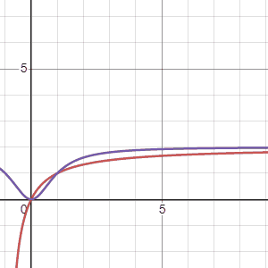

--- 
title: "Solutions for The Theoretical Biologist's Toolbox"
author: "Henry H. Hansen & Daniel Greenberg"
date: "`r Sys.Date()`"
site: bookdown::bookdown_site
documentclass: book
bibliography: [book.bib, packages.bib]
# url: your book url like https://bookdown.org/yihui/bookdown
# cover-image: path to the social sharing image like images/cover.jpg
description: |
  This is an online book of solutions for Marc Mangel's The Theoretical
  Biologist's Toolbox.
link-citations: yes
github-repo: rstudio/bookdown-demo
---

# Exercises

## Exercise 1 & 2  {-}

<script type="text/x-mathjax-config">
MathJax.Hub.Register.StartupHook("TeX Jax Ready",function () {
  MathJax.Hub.Insert(MathJax.InputJax.TeX.Definitions.macros,{
    cancel: ["Extension","cancel"],
    bcancel: ["Extension","cancel"],
    xcancel: ["Extension","cancel"],
    cancelto: ["Extension","cancel"]
  });
});
</script>


> **_Math Prerequisite:_** Algebra and Inequality Functions

```{r, echo=T, results='hide', warning=F, message=FALSE}
library(tidyverse)
```

### The biology

The concept and the impact of the choices one makes, often gets taken for granted. In the ecological and evolutionary arena, choices govern many of the phenomenon we observe. An organism must use its resources in an effective manner to survive and reproduce. The collection of choices that an organism makes could be considered a strategy and when that strategy is passed on to future generations, we can start to see how generalist and specialist behaviors arise.

In the simplest arrangement, we could consider a single predator, say a wolf, that has two choices of prey, $i$, where each type of prey has a distinct energy benefit, $E$,for the predator . This energy benefit will depend on how long it takes to handle and consume the prey, $h$. For example, the energy benefit of a wolf trying to catch a rabbit versus trying to catch a beaver. And will also depend on often the predator will encounter each prey type, $\lambda$. Given these assumptions we could argue that the best prey items are the ones that give us the most amount of energy with the least amount of effort!

With this in mind let's start by writing some of these down with labels.

$$
i \text{ indicates an index for prey (1 = 1st prey, 2 = 2nd prey)}
\\[10pt]
E_i = \text{net energy gain}
\\[10pt]
h_i = \text{handling and consumption time}
\\[10pt]
\lambda_i = \text{encounter rate of prey}
\\[10pt]
\frac{E_i}{h_i} = \text{prey value}
$$

In Marc's book we assume that prey type 1 is more profitable than prey type 2. That means for now on we replace $i$ with 1. So if you were the predator and had to choose among prey items, would you only go after prey 1 or would you go after anything you encountered? The first way is the way of the specialist, while the second is the way of the generalist. The really exciting part is that we can figure out which strategy is more effective, at least from the energy perspective. But we still need a couple more pieces to figure this out.

First, the effectiveness of a strategy is dependent on how long we watch either approach so we should assume a long time period to better match what we might see in the wild. Now that we have this long time period $T$, we have to break this into two categories, time spent searching, $S$, and time spent handling prey after finding it, $H$. Let's put this relationship down.

$$
T = S + H = \text{ total time period is the combination of searching and handling time }
$$

Now take note that $h$ and $H$ are not the same.$H$ is just a placeholder, what we really want to do is to plug in our parameters from above. If $S$ is search time with no prey, $H$ must be the time spent handling any prey that we encountered after searching for it. We can just combine these by multiplying!

$$
H = h_1(\lambda S) = \text{total prey handling time after search and encounter}
$$

With these major pieces figured out we can put $S$ and $H$ back into our total time equation. This is super important because we can now rearrange this master equation to figure out the tradeoffs between our different strategies. Let me show you.

$$
T = S + H = S + h_1(\lambda S) \text{ master time equation with search and handling}
\\[10pt]
T = S(1 + h_1\lambda) \text{ master time equation simplified}
\\[10pt]
S = \frac{T}{h_1\lambda} \text{master search equation}
$$

All we need to do now is bring in the final piece of our puzzle, $E$! Remember, $E$ is net energy for a prey type so the total net energy is going to be, $E$, for every prey we encountered, $\lambda$, for the entire search time $S$. The rate at which this total net energy is acquired for a predator is just total net energy divided by time. In other words energy from consumed prey per unit of time.

$$
R_s = \frac{E_1\lambda_1S}{S(1+h_1\lambda)} = \text{energy rate for predator}
\\[10pt]
R_s = \frac{E_1\lambda_1}{1+h_1\lambda} = \text{energy rate for predator simplified (S cancels out)}
$$

Fantastic, we now have an equation for the specialist strategy that tells us exactly how much energy a predator gets for a time period when hunting prey type 1!

### The challenge

So here comes the challenge! Now that we know what the specialist strategy looks like how can we figure out the generalist approach? And how do we compare the two? So for the first part we need to include prey type 2. And for comparing the models we need to show how the encounter rate for prey type 1 could govern strategy choice. In other words show that the specialist strategy yields a greater energy rate than the generalist strategy by solving for $\lambda1$. Thankfully, Marc has given us what the final outcomes should look like for both problems.

$$
R_g = \frac{E_1\lambda_1+E_2\lambda_2}{1+h_1\lambda_1+h_2\lambda_2} = \text{Generalist strategy}
\\[10pt]
\lambda_1 > \frac{E_2}{E_1h_2-E_2h_1} = \text{Specialist strategy advantage}
$$

<center>
**Produce an equation for the generalist strategy and show how the specialist strategy could be more effective because of encounter rate of prey type 1**
</center>


### The solution

#### Part 1 (Exercise 1.1)
So for the generalist strategy we just need to include prey type 2, therefore we can recycle many of the same terms and solve for the equation using a similar approach. Remember we want total energy gained for each species divided by total time.
$$
\textsf{Create master time equation with both prey handling times}
\\[10pt]
T = S + H_1 + H_2
\\[10pt]
\textsf{Substitute the placeholder H with our equation for total prey handling time after search and encounter}
\\[10pt]
T = S + h_1(\lambda_1 S) + h_2(\lambda_2 S)
\\[10pt]
\textsf{Simplify equation by factoring out S}
\\[10pt]
T = S( 1 + h_1\lambda_1 + h_2\lambda_2)
\\[10pt]
\textsf{Solve for S}
\\[10pt]
S = \frac{T}{( 1 + h_1\lambda_1 + h_2\lambda_2)}
\\[10pt]
\textsf{Bring in total net energy for each prey using S and divide by total time}
\\[10pt]
R_g = \frac{E_1\lambda_1S + E_2\lambda_2S}{S( 1 + h_1\lambda_1 + h_2\lambda_2)}
\\[10pt]
\textsf{factor out S and cancel}
\\[10pt]
R_g = \frac{\cancel{S}(E_1\lambda_1 + E_2\lambda_2)}{\cancel{S}( 1 + h_1\lambda_1 + h_2\lambda_2)}
\\[10pt]
R_g = \frac{(E_1\lambda_1 + E_2\lambda_2)}{( 1 + h_1\lambda_1 + h_2\lambda_2)}
$$

#### Part 2 (Exercise 1.2)
For this part we need to show that $R_s>R_g$ by using $lambda_1$. So let's set these equations accordingly and solve for $lambda_1$!

$$
R_s>R_g \text{ is the same as } \frac{E_1\lambda_1}{1+h_1\lambda} > \frac{E_1\lambda_1 + E_2\lambda_2}{ 1 + h_1\lambda_1 + h_2\lambda_2}
\\[10pt]
\textsf{start by multiplying both sides by the bottom of each fraction and cancel terms}
\\[10pt]
\frac{E_1\lambda_1( 1 + h_1\lambda_1 + h_2\lambda_2)\cancel{(1+h_1\lambda)}}{\cancel{1+h_1\lambda}} > \frac{E_1\lambda_1 + E_2\lambda_2\cancel{( 1 + h_1\lambda_1 + h_2\lambda_2)} (1+h_1\lambda)}{\cancel{1 + h_1\lambda_1 + h_2\lambda_2}}
\\[10pt]
\textsf{after canceling it should look like this}
\\[10pt]
E_1\lambda_1( 1 + h_1\lambda_1 + h_2\lambda_2) > (E_1\lambda_1 + E_2\lambda_2) (1+h_1\lambda_1)
\\[10pt]
\textsf{expand terms}
\\[10pt]
E_1\lambda_1 + E_1\lambda_1h_1\lambda_1 + E_1\lambda_1h_2\lambda_2 > E_1\lambda_1 + E_2\lambda_2\ + E_1\lambda_1h_1\lambda_1+ E_2\lambda_2h_1\lambda_1
\\[10pt]
\textsf{cancel terms}
\\[10pt]
\cancel{E_1\lambda_1} + \cancel{E_1\lambda_1h_1\lambda_1} + E_1\lambda_1h_2\lambda_2 > \cancel{E_1\lambda_1} + E_2\lambda_2\  + \cancel{E_1\lambda_1h_1\lambda_1} + E_2\lambda_2h_1\lambda_1
\\[10pt]
\textsf{bring all } \lambda_1 \textsf{ to the left side}
\\[10pt]
E_1\lambda_1h_2\lambda_2 - E_2\lambda_2h_1\lambda_1 > E_2\lambda_2\ 
\\[10pt]
\textsf{factor out } \lambda_1
\\[10pt]
\lambda_1(E_1h_2\lambda_2 - E_2\lambda_2h_1) > E_2\lambda_2\ 
\\[10pt]
 \textsf{ and then divide and simplify by canceling } \lambda_2
 \\[10pt]
 \lambda_1 > \frac{E_2}{E_1h_2-E_2h_1}
$$

## Exercise 3 {-}

> **_Math Prerequisite:_** Algebra and Plane Geometry

```{r, echo=FALSE}
library(tidyverse)
library(fishualize)
```

### The biology
Marc introduces us to a new foraging model. In this scenario there is only type of food and they are evenly dispersed in patches throughout an area. This means that the travel time between each patch of food is the same. The predator must decide how long to stay in the patch before moving on to the next one. Marc calls this patch residence time, $\tau$, the greek letter tau. He also describes the patches as exhaustible so the amount of energy gained at single patch naturally increases but becomes asymptotic over time. This kind of scenario would be quite similar to a bird flying between trees in an cherry orchard, eating all of the cherries at one tree, and then moving on to the next tree. So how do we model the relationship between energy and time spent at a patch?  Marc provides two possibilities for this "energy gain" function, we will call this $G(t)$.


$$
\tau \text{ is the time spent at a patch}
\\[10pt]
G(\tau) \text{ is the function for energy gain}
\\[10pt]
$$
Below are the two options that Marc suggests to model this relationship.
$$
G_1(\tau) = \frac{a\tau}{(b+\tau)} \text{ first gain function}
\\[10pt]
G_2(\tau) = \frac{a\tau^2}{(b+\tau^2)} \text{ second gain function}
\\[10pt]
$$

### The challenge

<center>
**Draw each gain function and explain what the individual parameters (a and b) represent**
</center>

### The solution

Equations plotted using Desmos graphing calculator (https://www.desmos.com/calculator)

<p align="center">


</p>

Using the two models Marc suggested, $G_1(\tau)$, the first equation, is in red and the second equation, $G_2(\tau)$ is in purple, we can see how these models change when the parameters "$a$" (first gif) and "$b$" (second gif) are adjusted. The first thing to notice is that both models arrive at an asymtote but the second model has a concave shape before arriving to an asymtote while the first model maintains a convex shape for all positive numbers. Another thing to notice is that the second model reaches asymptote at a faster rate. 

Regarding the parameters Marc says the following: "Possible values for variables $a$, $b$ are foraging costs and food abundance in the patches. Note that the same constants ($a$ and $b$) are used in the expression, but they have different meanings. Since we’ll be measuring gain in energy units, kilocalories, this implies that $b$ will be in units of time, minutes in $G_1(\tau)$ and minutes$^2$ in $G_2(\tau)$.Variable $a$ will be in units of energy, kilocalories in $G_1(\tau)$ and kilocalories in $G_2(\tau)$."

### Checking our work

While plotting the individual functions on paper (or a graphing calculator) is rather self-explanatory we could also show the same thing using R just for consistency.

```{r}

a = 1 # parameter value for a
b = 0.5 # parameter value for b

ggplot(data.frame(x=c(0, 10)), aes(x)) + 
  stat_function(fun=function(x) a*x/(b +x)) + #G1(t)
  stat_function(fun=function(x) a*x^2/(b + x^2), color = "red") + #G2(t)
  theme_minimal() +
  labs(x = "Residence Time (t)", y = "Gain, G(t)")
```

If we take it a step further we can also add the tangent line Marc was referring to in his book using the same equation in figure 1.3

```{r}

a = 1 # parameter value for a
b = 3 # parameter value for b is now changed to 3

# How do we figure out the slope for the tangent line?
#First assume Tau is 3 just like in Figure 1.3 so we are reproducing the same graph
#Then add that point to the graph (-3,0) - remember that we are interpreting Tau as a negative here
#Then increase slope until the line is tangent to the gain curve


ggplot(data.frame(x=c(0, 20)), aes(x)) + #the data entry for x is also longer
  stat_function(fun=function(x) a*x/(b +x)) + #G1(t)
  geom_point(aes(x=-3, y=0), colour="blue") + #adding on the negative tau,0 point
  geom_abline(slope = 1/12, intercept = 0.25) + #here is the tangent line added as just a guess
  theme_minimal() +
  coord_cartesian(xlim = c(-5,20), ylim = c(0,1)) + # adjusting the graph to see everything
  labs(x = "Residence Time (t)", y = "Gain, G(t)")

```


### Reflecting on the biology

I think one of the main considerations one should grapple with is asking ourselves, how do predators know when to leave? In the original paper by Charnov, he mentions the following:

~~~
The simple  tendency  for  a predator  to  remain  in  the  area where  it  was successful  has been  documented  for  birds (Tinbergen, Impekoven, and  Frank, 1967;  Krebs, MacRoberts, and Cullen, 1972);  fish (Beukema, 1968);  insects (Hafez,  1961; Fleschner, 1950; Laing, 1938; Mitchell, 1963; Dixon, 1959, 1970; Banks, 1957;  Richerson and  Borden, 1972;  Hassell and  May, 1973;  Murdie and  Hassell, 1973).  Even  unicellular predators  exhibit increased  frequency of turning following an  encounter with food particles, a  behavior pattern that results  in  a more  intensive search of  the  vicinity of  the  capture  (Fraenkel and Gunn, 1940; MacNab and  Koshland, 1972).
~~~

I personally think that finding this kinds of fundamental relationships are becoming increasingly easier to investigate with the development of remote sensing and animal tracking technology. Of course, if one were to actually develop a study on this topic, they would soon realize that "patches" are not perfect little circles. Additionally the space between patches are not remotely consistent in the real world. Finding regions of the world that are untainted by the human enterprise certainly poses new challenges for investigating such relationships when so much has become altered. Imagine for example, a predatory fish that must navigate a now turbid and polluted lake with many dams in it's streams, or a puma that hunts different herds of deer but must contend with highways and roads. The *marginal value* a predator gets by staying at a patch is likely not constant as the world it tries to persist in is constantly changing. 

## Exercise 4 {-}

> **_Math Prerequisite:_** Calculus and Power Rule

```{r, echo=T, results='hide'}
library(tidyverse)
library(fishualize)
```

### The biology

Imagine you are a female salmon, and you want to have as many children as possible and hope they survive, how many eggs should you have and how big should they be? Well, this of course depends on a number of factors. For starters, the number of eggs you lay depends on how big your gonads are. Secondly, the size of your eggs influences their survival, the bigger the egg, the better their survival. So put another way, given that you have a limited size and that you want the maximum amount of eggs to survive, how big should the eggs be?

Let's start by putting some of these ideas onto paper and with proper names.

$$
x = \text{mass of a single egg}
\\[10pt]
g = \text{mass of female gonads}
\\[10pt]
S() = \text{survival function}
$$
Great! Now how do we link the two? Thankfully, Einum and Fleming (2000) have figured out an interesting relationship for us. Based on their experiment they found the following relationship for egg survival.
$$
S(x) = 1 - (\frac{x_{min}}{x})^{a}
$$
This means that given a minimum egg size $x_{min}$ and some scaling exponent $a$, we can calculate the survival of an egg. That's pretty cool! In there experiments the specific value for $x_{min}$ was 0.0676 g and for $a$ was 1.5066. Let's see what that looks like on a graph

```{r, fig.cap="Plot of egg size in relation to survival of eggs"}
xmin <- 0.0676 #x_min
a <- 1.5066 #a

#survival function
s <- function(x) {
  s = 1-(xmin/x)^a #the survival function
  if (s < 0) { # a rule that turns impossible negative survivals
    return(0)      # to 0
  }
  return(s)
}

#create a dataset based off the function
x = seq(0.01,0.5,0.01) # produce a range of egg sizes
surv = sapply(x, s) # apply the survival function to the egg sizes
egg_surv <- data.frame(x,surv) #combine the data

#plot the data
ggplot(egg_surv, aes(x,surv))+
  geom_line() +
  theme_minimal() +
  labs(x = "Egg size-grams", y = "Survival")

```


### The challenge

Now that we know what the survival function looks like let's try to link this to our "How big should the eggs be?" question. Let's call this question, reproductive success $R()$. But what should we put in this function. We know that gonad mass $g$ is going to be much larger than our egg mass $x$ so if we divide $g$ by $x$, that will tell us how many eggs we have.

$$
\text{number of eggs} = \frac{g}{x}
$$
So if we want to figure out reproductive success R(), we just need to multiply the number of eggs by the survival function. This looks like this.

$$
R(g,x) = \frac{g}{x}S(x)=\frac{g}{x}1 - (\frac{x_{min}}{x})^{a}
$$

And a graph of the reproductive success function looks like this.

```{r, fig.cap="Reproductive success plot in relation to egg size for a female salmon with 450 g gonads"}
#reproductive success function

r <- function(g,x) {
  r <- (g/x)*s(x) #here is our reproductive success function
}

# Assuming our female salmon gonads weighs 450 grams, we can just add that to the previous data
egg_surv$female <- rep(450,length(egg_surv$x))

# Now we can calculate the corresponding reproductive success
repro = mapply(r, egg_surv$female, x = egg_surv$x)

# attach to our data
egg_surv$repro <- repro

# and plot it!

ggplot(egg_surv, aes(x,repro))+
  geom_line() +
  theme_minimal() +
  labs(x = "Egg size-grams", y = "Reproductive Success -R(450,x)")

```


So here comes the challenge! Now that we know what the reproductive success looks like how can we figure out the optimal egg size for our female salmon? If you don't remember your math techniques, it's ok! One thing we could do is to take the derivative of the reproductive success function. *Remember, a derivative tells us the amount by which a function is changing at one given point.* This will tell us how reproductive success changes instantaneously. The place where the change is equal to 0 is our optimum. So, we could solve that equation for x when it's equal to 0 and that will tell us exactly where the optimum is.

<center>
**Take the derivative of R(g,x) with respect to x, and solve for x when R' is = 0.**
</center>


### The solution

#### Simplify the equation

The first thing we can do is group together our constants in the survival function, $a$ and $x_{min}$, that way we don't have to wrestle with them when we are doing our calculus. For simplicity we will define $(x_{min})^a=c$. That will mean that our constants, $c$, includes both of these terms. So what does our equation look like now?

$$
S(x) = 1 - (\frac{x_{min}}{x})^{a} 
\\[10pt]
(x_{min})^a=c
\\[10pt]
S(x) = 1-cx^{-a}
$$

Next, let's put this back into our reproductive success function.

$$
R(g,x) = \frac{g}{x}1-cx^{-a}
$$
Now before we take the derivative to the reproductive success function, we want to move $g$ to the other side. This will change the function so we are only optimizing for the input $x$.

$$
R(g,x) = \frac{g}{x}1-cx^{-a}
\\[10pt]
\frac{R(x)}{g} = \frac{1}{x}(1-cx^{-a})
\\[10pt]
\frac{R(x)}{g} = x^{-1}-cx^{-a-1}
$$
Now we can take the derivative!

#### Take the derivative

$$
\frac{d}{dx}(\frac{1}{x}-cx^{-a-1})
\\[10pt]
\textsf{Differentiate the sum term by term and factor out constants}
\\[10pt]
\frac{d}{dx}(\frac{1}{x})-c(\frac{d}{dx}(x^{-a-1}))
\\[10pt]
\textsf{Use the power rule } \frac{d}{dx}(x^n) = n x^{(n - 1)}, \textsf{where } n = - 1.
\\[10pt]
\begin{aligned}
&\frac{d}{dx}\left(\frac{1}{x}\right)=\frac{d}{dx}\left(x^{-1}\right)=-x^{-2}: \\
&=-c\left(\frac{d}{dx}\left(x^{-1-a}\right)\right)+-\frac{1}{x^{2}}
\end{aligned}
\\[10pt]
\textsf{Use the power rule, }\frac{d}{dx}\left(x^{n}\right)=n x^{n-1}\textsf{, where } n=-a-1
\\
\begin{aligned}
&\frac{d}{dx}\left(x^{-a-1}\right)=(-a-1) x^{-a-2} \\
&=-\frac{1}{x^{2}}-\left((-1-a) x^{-2-a}\right) c
\end{aligned}
\\[10pt]
\textsf{Here is the final derivative}
=-\frac{1}{x^{2}}-\left((-1-a) x^{-2-a}\right) c
$$

#### Solve for x

Now we take the derivative, equate it to 0, and solve for x.

$$
-\frac{1}{x^{2}}-\left((-1-a) x^{-2-a}\right) c = 0
\\[10pt]
\textsf{Move over the first term by using addition}
\\[10pt]
-\left((-1-a) x^{-2-a}\right) c = \frac{1}{x^{2}}
\\[10pt]
\textsf{Divide by the powered term}
\\[10pt]
\frac{-\left((-1-a) x^{-2-a}\right)c}{x^{-2-a}}=\frac{x^{-2}}{x^{-2-a}}
\\[10pt]
c(a+1)=x^a
\\[10pt]
\textsf{take the }a \textsf{ root of x}
\\[10pt]
x=\sqrt[a]{c(a+1)}
$$

Finally, we have figured out how to calculate our optimum! This should tell us what our egg size should be!

### Checking our work
Let's test this equation and see if we get close to our expected answer. Remember, we want to find the optimum egg size. According to the reproductive success graph we should expect an egg size around 0.12 grams. Is that what we get when we plug it into R?

A quick side note, remember $c = (x_{min})^a$ so those constants need to come back into our calculation!


```{r}
 (xmin^a*(a+1))^(1/a)
```
Perfect, our calculation of 0.124 grams is exactly where we expected it!

### Reflecting on the biology

To summarize, we figured out how egg survival and reproductive success of salmon can be influenced by the size of the egg. When we combine these two ideas together, we were able to figure out what is the ideal reproductive strategy for female salmon of a given size. If you were to go out in the cold waters of Sweden when the salmon are spawning and you managed to catch some females over a range of sizes, and thus different gonad sizes, and then tracked the egg survival you would get something like the following. The red line is the optimum egg value we calculated in relation to the different reproductive success outcomes given a range of female sizes and egg sizes.

```{r}
# Assuming our female salmon gonads weigh from 400 to 500 grams
females <- seq(300,600,1)

# Then we create placeholder values for all the different egg sizes we are interested in
sweden <- data.frame(all_females = rep(females,each =length(egg_surv$x)),
all_eggs = rep(x,times=length(females)))

# Now we can calculate the corresponding reproductive success
sweden$repro = mapply(r, sweden$all_females, x = sweden$all_eggs)

# and plot it!
ggplot(sweden, aes(all_eggs,repro, color=factor(all_females)))+
  geom_line() +
  scale_colour_viridis_d() +
  geom_vline(xintercept = 0.124,color = "red",size = 1.5) +
  add_fishape(family = "Salmonidae",
              option = "Oncorhynchus_nerka", #Technically, this is the wrong species but close enough :) 
              xmin = 0.3,
              xmax = 0.5,
              ymin = 2000,
              ymax = 3000,
              fill = fish(option = "Oncorhynchus_nerka", n = 4)[2],
               alpha = 0.8) +
  theme_minimal() +
  labs(x="Egg size - grams", y = "Reproductive Success - R(300:600,x)", fill = "Gonad Weight-grams")+ 
  theme(legend.position = "none")

```


## Exercise 5 {-}

> ***Math Prerequisite:*** Calculus, Quotient Rule, Chain Rule, and Quadratic Formula

```{r}
library(tidyverse)
library(RColorBrewer)
```

### The biology

This exercise is focused on reproduction strategies, specifically concerning parasitic wasps. As Marc mentioned, these wasps have a haplo-diploid system where males comes from unfertilized eggs and females come from fertilized eggs. Unless you are the unfortunate organism chosen as a host, there is an interesting theoretical question to consider. That is, what kind of sex ratio should we expect when competing reproductive strategies are at play? Here, presents this question under the theory of the "unbeatable" sex ratio originally published by Hamilton. I would strongly encourage reading this good overview of the topic - https://www.cell.com/current-biology/comments/S0960-9822(17)30578-X

But concerning Marc's exercise he presents the following premise, an unbeatable sex ratio exists if the fitness of a "mutant" strategy

```{r}
fit <- function(r, rs, E, N) E^2*(1-r)+E^2*((1-r)+N*(1-rs))*(r/(r+N*rs))
E = 10
N = 100
# r = 0.5
# rs = 0.5
# fit(r,rs,E,N)
r_x <- seq(0.1, 0.9, by=.1)
rs_y <- seq(0.1, 0.9, by=.1)

res <- mapply(fit, list(r_x), rs_y, E, N)

cols <- brewer.pal(n = 9, name = "Spectral")
par(mar = c(5, 5, 3, 8), xpd=TRUE)
matplot(r_x, res, col=cols, type="l", lty=1, lwd=2, xlab="Mutant individual’s fraction of sons", ylab="Fitness")
legend("right",  inset = c(- 0.35, 0), legend=rs_y, title="Normal individual’s \n fraction of sons", lwd=2, col=cols, bty="n")
```


### The challenge

### The solution

#### The first part is to take the derivative to the fitness equation with respect to $r$
$$
\\[10pt]
W\left(r, r^{*}\right)=E^{2}(1-r)+E^{2}\left\{(1-r)+N\left(1-r^{*}\right)\right\}\left[\frac{r}{r+N r^{*}}\right] = \text{Fitness Equation}
\\[10pt]
\textsf{Move the } E^2 \textsf{ term to the left to make our function proportional to eggs (just makes the calculus easier) and distribute last term}
\\[10pt]
\frac{W\left(r, r^{*}\right)}{E^{2}}=(1-r)+\frac{r(1-r)}{r+N r^{*}}+\frac{r N\left(1-r^{*}\right)}{r+N r^{*}}
\\[10pt]
\textsf{take the derivative with respect to r}
\\[10pt]
\frac{d}{dr}(1-r) = 0-1 \textsf{ derivative of the first term}
\\[10pt]
\textsf{ for the second term we need to use the quotient rule } \frac{d}{d r}\left(\frac{u}{v}\right)=\frac{v \frac{d u}{d r}-u \frac{d v}{d r}}{v^{2}} \text {, where } u=r(1-r) \text { and } v=r+Nr^* 
\\[10pt]
\frac{d}{dr}(\frac{r(1-r)}{r+N r^{*}}) = \frac{(r+Nr^*)(\frac{d}{dr}r(1-r))-r(1-r)(\frac{d}{dr}(r+Nr^*))}{(r+Nr^*)^2}
\\[10pt]
\textsf{take the derivatives for the components in the numerator by simplifyling the first one and taking the derivative}
\\[10pt]
\frac{d}{dr}r(1-r) = \frac{d}{dr}r-r^2= 1-2r
\\[10pt] \textsf{ and } 
\\[10pt]
\frac{d}{dr}(r+Nr^*)) = 1 + 0
\\[10pt]
\textsf{before we jump to the last term let's simplify what we have so far}
-1+\frac{(r+Nr^*)(1-2r)-r(1-r)(1)}{(r+Nr^*)^2} + \frac{d}{dr}(\frac{r N\left(1-r^{*}\right)}{r+N r^{*}})
\\[10pt]
\textsf{to take the derivative of the final term we pull out the constants and apply the quotient rule again}
\\[10pt]
(1-r^*)N\frac{d}{dr}(\frac{r}{r+Nr^*}) = (1-r^*)N\frac{(r+Nr^*)(\frac{d}{dr}r)-r(\frac{d}{dr}(r+Nr^*))}{(r+Nr^*)^2}
\\[10pt]
\textsf{since we know what the derivative of }r \textsf{ and } r+Nr^* \textsf{ is from the previous quotient rule the final derivative of the term is}
\\[10pt]
(1-r^*)N\frac{(r+Nr^*)-r}{(r+Nr^*)^2}
\\[10pt]
\textsf{so if we put all the terms together for our final derivative and simplify the ugly looking second term we get}
\\[10pt]
-1+\frac{-r^2+Nr^*-2rNr^*}{(r+Nr^*)^2} + (1-r^*)N\frac{r+Nr^*-r}{(r+Nr^*)^2}
$$

#### The second part is to substitute $r$ for $r^*$ and simplify

$$
\textsf{so let's start by replacing all the } r \textsf{ with } r^*
\\[10pt]
-1+\frac{-r^2+Nr^*-2rNr^*}{(r+Nr^*)^2} + (1-r^*)N\frac{r+Nr^*)-r}{(r+Nr^*)^2} \textsf{ becomes}
\\[20pt]
-1+\frac{-r^{*2}+Nr^*-2r^*Nr^*}{(r^*+Nr^*)^2} + (1-r^*)N\frac{r^*+Nr^*-r^*}{(r^*+Nr^*)^2}
\\[10pt]
\textsf{let's start by simplifying the leading factor in the 3rd term and combine like terms}
\\[10pt]
-1+\frac{-r^{*2}+Nr^*-2r^*Nr^*+N^2r^*(1-r^*)}{(r^*+Nr^*)^2}
\\[10pt]
\textsf{move 1 and the denominator to the other side and start simplfying things}
\\[10pt]
(r^*+Nr^*)^2 = -r^{*2}+Nr^*-2r^*Nr^*+N^2r^*(1-r^*) \textsf{ which is the same as }
\\[10pt]
r^{*2}+2Nr^{*2}+N^2r^{*2}= -r^{*2}+Nr^*-2Nr^{*2}+N^2r^*-N^2r^{*2}
\\[10pt]
\textsf{the important thing to to notice is we can combine all the terms now}
\\[10pt]
-2r^{*2}+Nr^*-4Nr^{*2}+N^2r^*-2N^2r^{*2}
\\[10pt]
\textsf{now we can factor out like variables}
\\[10pt]
r^*(N + N^2)+r^{*2}(-2-4N-2N^2)
\\[10pt]
\textsf{now we rearrange so it can be used in the quadratic formula}
\\[10pt]
-2(N+1)^2r^{*2} + (N(N+1))r^* + 0
$$

#### The final part is to plug in the equation into the quadratic formula

$$
\textsf{The quadratic formula is the following: }
x=\frac{-b\pm\sqrt{b^2-4ac}}{2a}
\\[10pt]
\textsf{plug in the equation components}
\\[10pt]
r^{*}=\frac{-N(N+1) \pm \sqrt{(N(N+1))^{2}}}{2\left(-2(N+1)^{2}\right)}
\\[20pt]
\textsf{and solve}
\\[10pt]
r^{*}=\frac{-2 N(N+1)}{2\left(-2(N+1)^{2}\right)}
\\[20pt]
\textsf{and simplify}
\\[10pt]
r^{*}=\frac{N}{2(N+1)}
$$

### Checking our work

This was a beast of an exercise. There were so many steps, lots of ways to make mistakes, and a ridiculous amount of simplifying to keep track of everything.  And even if you didn't make it to the end, take a moment to be proud of your attempt. Science is one of those disciplines that is both a blessing and a curse in that the only answers you get are the ones you find yourself. Being thorough is just one piece of the scientific enterprise that I definitely felt was highlighted with this exercise. Much more would be needed to develop a publication so it's good practice to get acquainted with persistence now.

